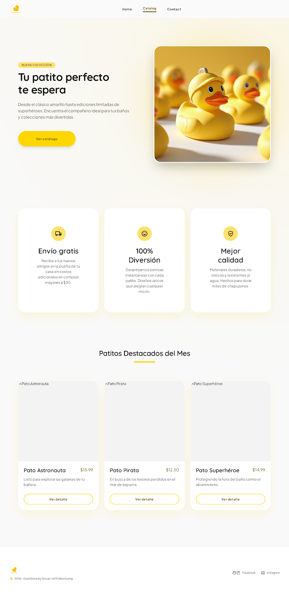
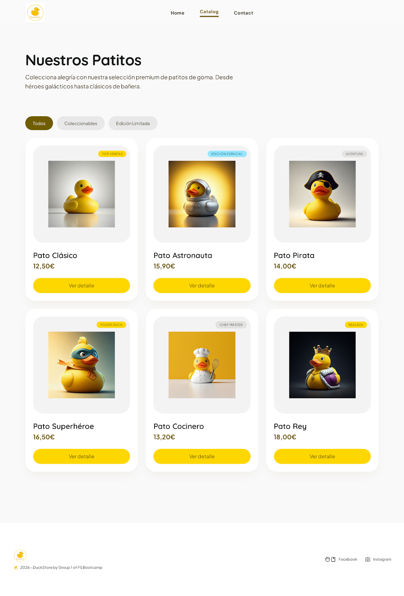
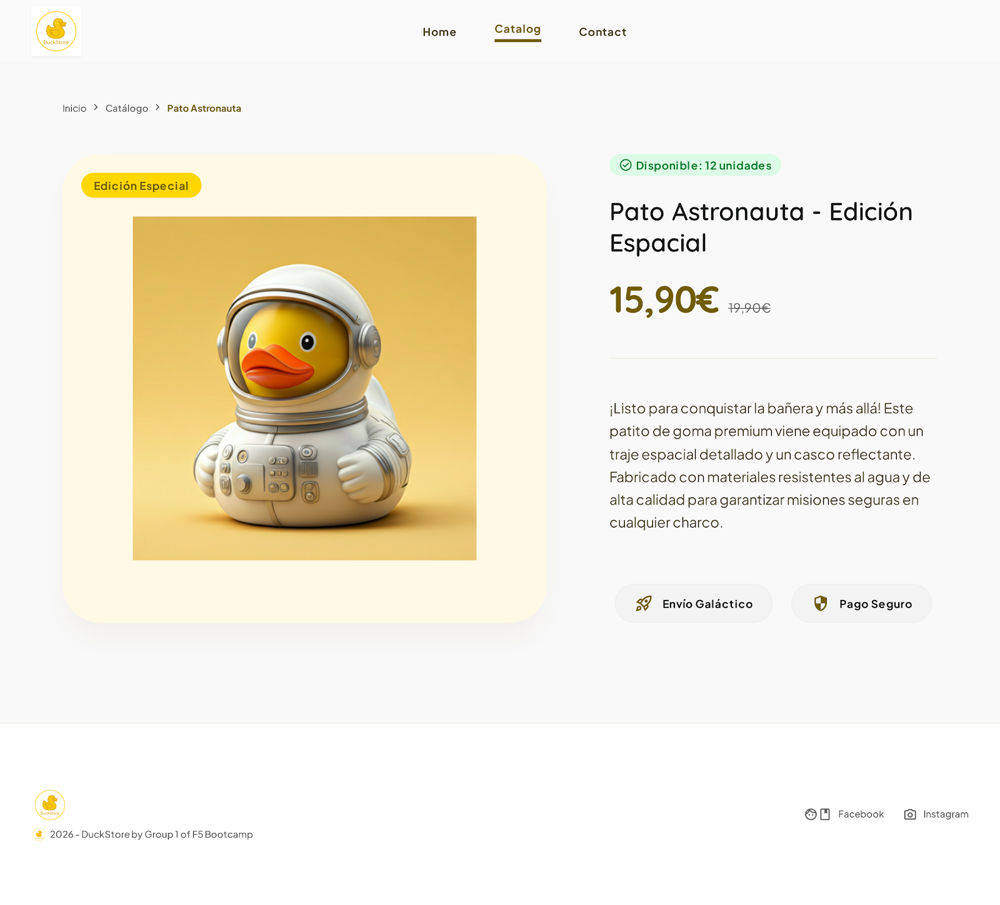
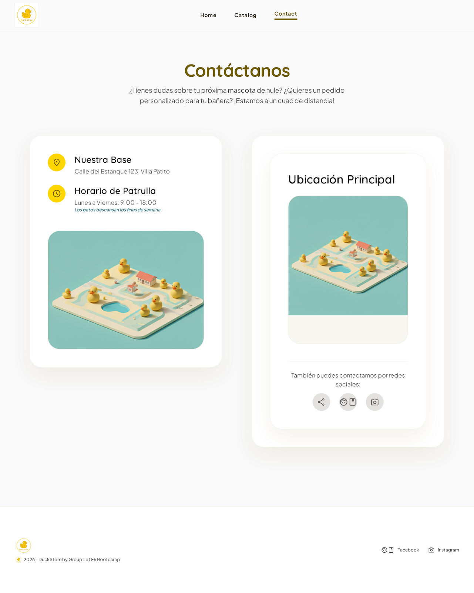

# 🦆 DuckStore 🦆

> *"No son simples patitos de goma. Son compañeros de aventuras."*

---

# 📖 Descripción

DuckStore es una página web estática desarrollada como proyecto frontend 
para simular una tienda online especializada en patitos de goma coleccionables.

El objetivo principal del proyecto es diseñar y maquetar una experiencia visual moderna,
responsive y accesible utilizando únicamente **HTML5** y **CSS3**, siguiendo un flujo completo de diseño:
desde wireframes y mockups hasta el desarrollo final.

La tienda presenta diferentes tipos de patitos temáticos:
astronautas, piratas, superhéroes, cocineros y ediciones especiales,
mostrando una identidad visual divertida, minimalista y moderna.

El proyecto fue diseñado inicialmente en Figma/Stitch y posteriormente desarrollado
en Visual Studio Code respetando la estructura semántica HTML5 y las buenas prácticas CSS.

---

# 🔍 Análisis

Antes de comenzar el desarrollo se realizó un análisis completo de los requisitos funcionales y visuales.

La web debía representar un pequeño ecommerce estático con una navegación clara,
una identidad visual coherente y una experiencia responsive.

Se dividió el proyecto en 4 páginas principales:

1. 🏠 Landing page
2. 🛍️ Catálogo
3. 🦆 Detalle de producto
4. 📩 Contacto

Cada página cumple un objetivo específico dentro del flujo de navegación del usuario.

---

# 🗺️ Estructura de páginas

## 🏠 Home

Landing page principal donde se presenta la marca DuckStore,
sus beneficios y una selección destacada de productos.

### Incluye:
- Hero section
- CTA principal
- Beneficios de la tienda
- Productos destacados
- Footer

---

## 🛍️ Catálogo

Página donde se muestran todos los patitos disponibles.

### Incluye:
- Grid responsive
- Cards de producto
- Imagen
- Nombre
- Precio
- Botón de detalle
- Categorías visuales

---

## 🦆 Detalle de producto

Vista individual de un producto destacado.

### Incluye:
- Imagen principal
- Nombre del producto
- Precio
- Descripción
- Estado de stock
- Información adicional

---

## 📩 Contacto

Página de contacto y ubicación de la tienda.

### Incluye:
- Dirección física
- Horario
- Redes sociales
- Imagen ilustrativa
- Información de contacto

---

# 📐 Planificación

Antes del desarrollo se realizaron:

- Prototipado en Stitch
- Wireframes de baja fidelidad
- Mockups visuales
- Diseño responsive

La estructura visual se planificó manteniendo consistencia en:

- Espaciados
- Paleta de colores
- Tipografía
- Botones
- Cards
- Componentes reutilizables

---

# 🎨 Diseño visual · Prototipo 

La identidad visual de DuckStore busca transmitir:

- diversión
- limpieza visual
- estilo moderno
- estética minimalista

## 🏠 Landing Page

---

## 🛍️ Página Catálogo

---

## 🦆 Página Detalle Producto

---

## 📩 Página Contacto

---

## 🎨 Paleta principal

- Primario: Amarillo pato (#FFD700)
- Secundario: Blanco roto (#333333)
- Terciario: Gris claro (#00B4D8)
- Neutral: Negro suave (#FFFFFF)

---

# ♿ Accesibilidad

El proyecto aplica conceptos básicos de accesibilidad:

- HTML semántico
- Uso correcto de headings
- Textos alternativos en imágenes
- Contraste visual adecuado
- Navegación clara
- Botones identificables

---
# 📸 Captura final del proyecto

## 🏠 Landing Page

---

## 🛍️ Página Catálogo

---

## 🦆 Página Detalle Producto

---

## 📩 Página Contacto

---

# 🛠️ Tecnologías

- HTML5
- CSS3
- Figma
- Stitch
- Visual Studio Code
- Git & GitHub
- Jira

---

# 📋 Planificación de commits

## 🚀 Commits iniciales
- `chore`: add .gitignore
- `docs`: add project to README
- `feat`: add project folder structure
- `feat`: add imgs to folder" 

## 🚀 Commits de Jenny (Homepage)
- `feat`: add homepage html structure
- `feat`: add homepage header
- `style`: add homepage header styles
- `feat`: add homepage hero
- `style`: add homepage hero styles
- `fix`: homepage header nav position
- `feat`: add homepage ventajas
- `style`: add homepage ventajas styles
- `fix`: homepage ventajas styles
- 
- 
- 

## 🚀 Commits de Nieves (Catálogo)
- 
- 
- 

## 🚀 Commits de Luisa (Detalle-producto)
- 
- 
- 

## 🚀 Commits de Viktoryia (Contacto)
- 
- 
- 

---

# 👨‍💻 Autoras

Proyecto desarrollado por:

**[Jennifer Sánchez Requejo]**  
**[ Nombre]**  
**[ Nombre]**  
**[ Nombre ]**  
Training Developers · F5 Bootcamp

---
