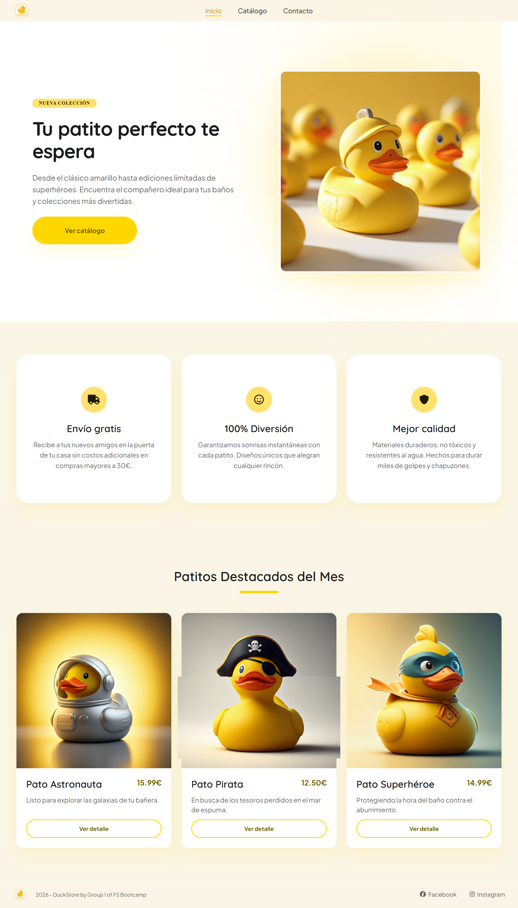
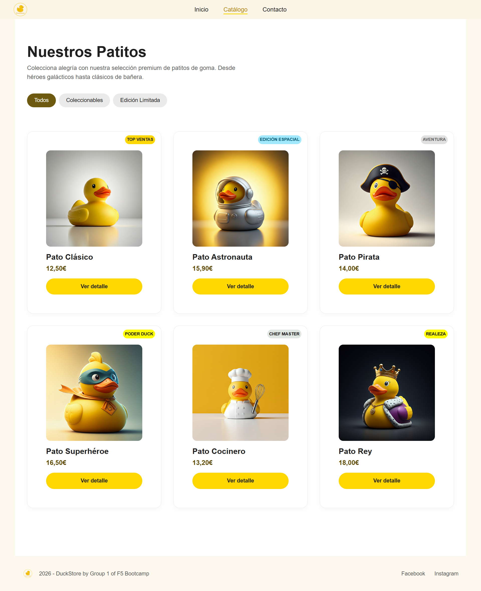
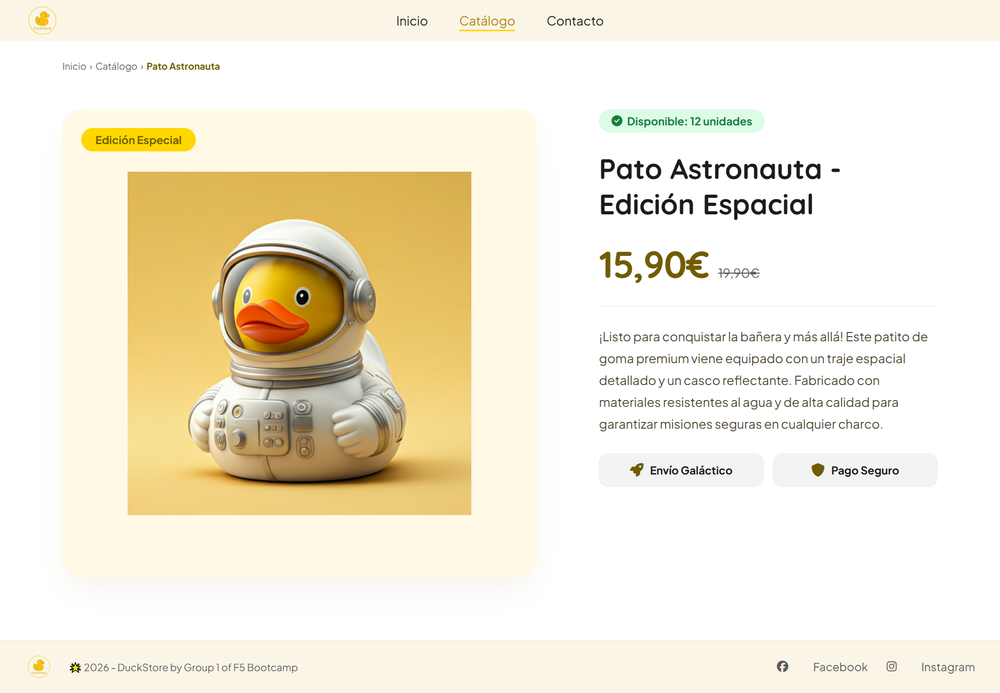
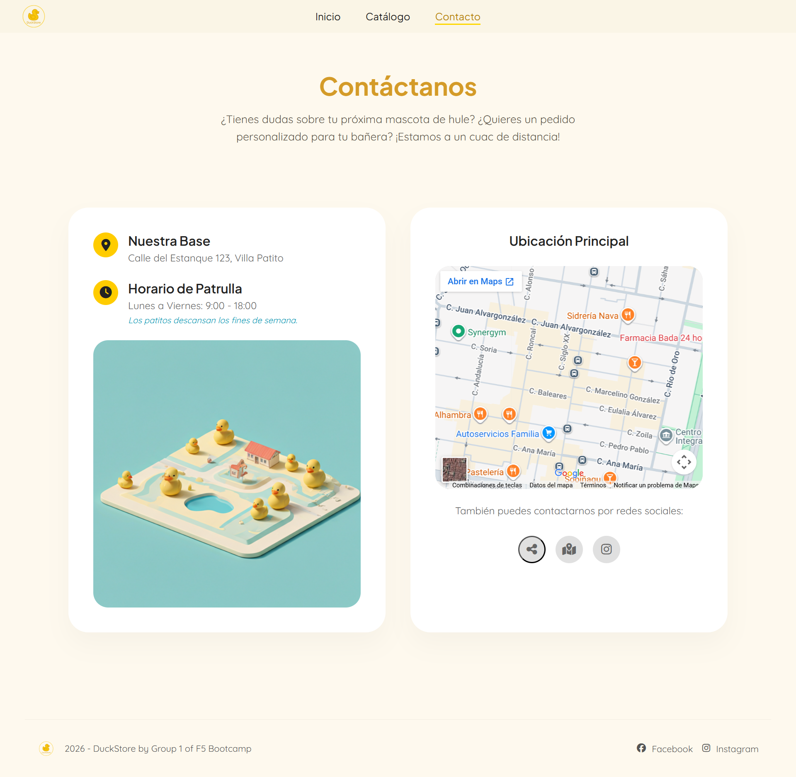
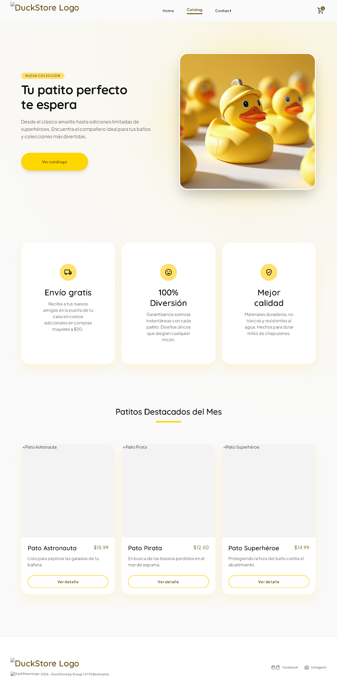
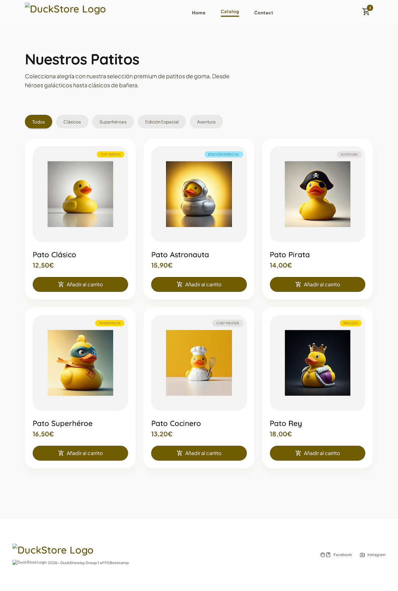
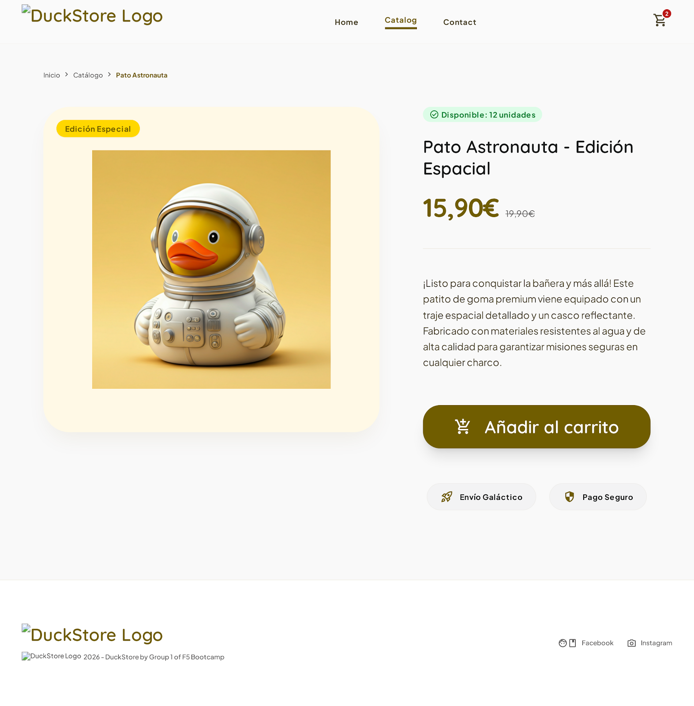
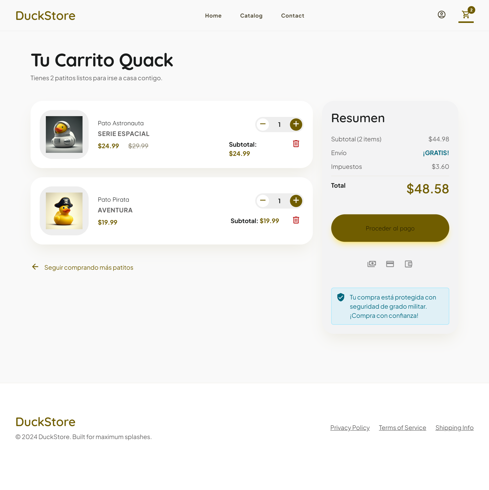
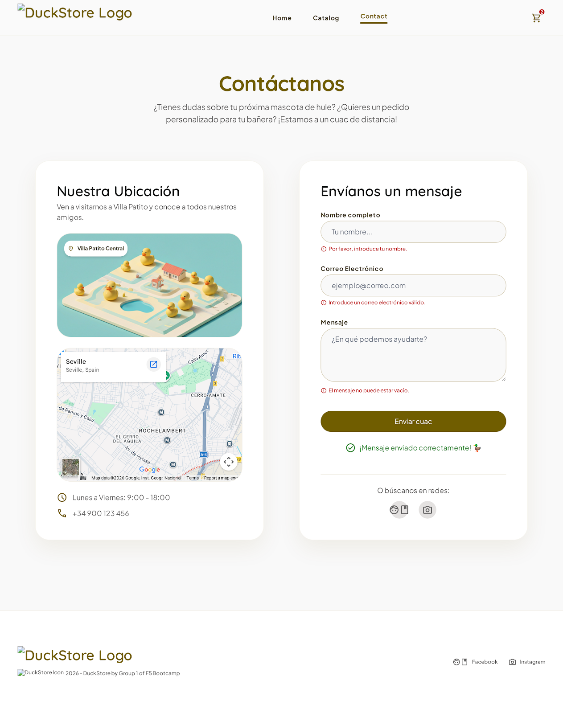
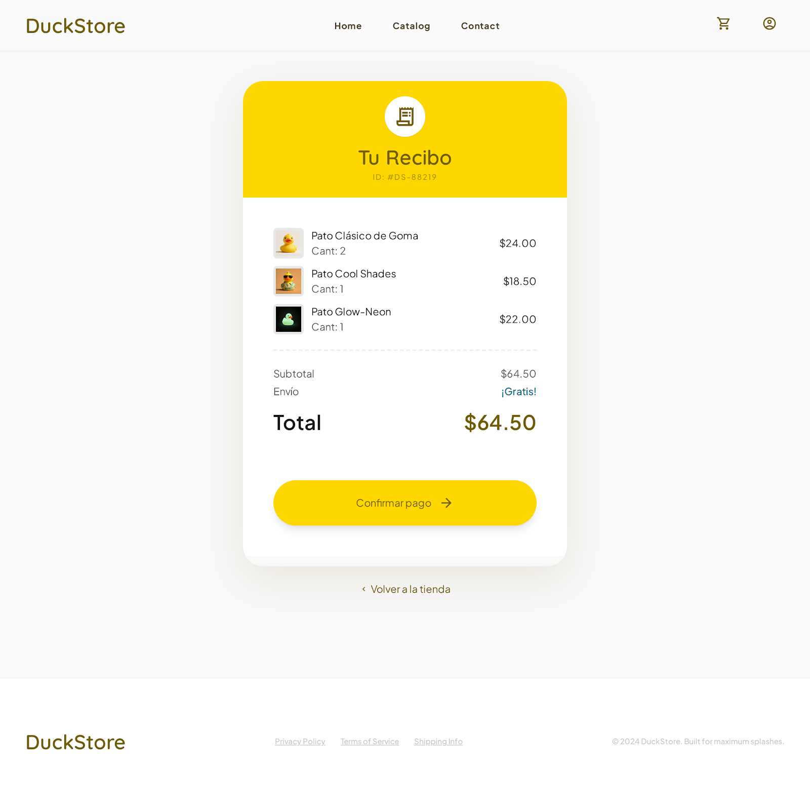

# 🦆 DuckStore 🦆

> *"No son simples patitos de goma. Son compañeros de aventuras."*

---

# 📖 Descripción

DuckStore es una tienda online especializada en patitos de goma coleccionables, desarrollada como proyecto frontend en dos fases:

- **Parte 1:** Diseño y maquetación estática con HTML5 y CSS3.
- **Parte 2:** Conversión a web dinámica con JavaScript, añadiendo catálogo interactivo, carrito de compras, filtros por categoría, formulario funcional y tests.

La tienda presenta diferentes tipos de patitos temáticos: astronautas, piratas, superhéroes, cocineros y ediciones especiales, con una identidad visual divertida, minimalista y moderna.

El proyecto fue diseñado inicialmente en Figma/Stitch y posteriormente desarrollado en Visual Studio Code respetando la estructura semántica HTML5 y las buenas prácticas CSS.

---

# — PARTE 1 —

---

# 🔍 Análisis

Antes de comenzar el desarrollo se realizó un análisis completo de los requisitos funcionales y visuales.

La web debía representar un pequeño ecommerce estático con una navegación clara, una identidad visual coherente y una experiencia responsive.

Se dividió el proyecto en 4 páginas principales:

1. 🏠 Landing page
2. 🛍️ Catálogo
3. 🦆 Detalle de producto
4. 📩 Contacto

Cada página cumple un objetivo específico dentro del flujo de navegación del usuario.

---

# 🗺️ Estructura de páginas

## 🏠 Home

Landing page principal donde se presenta la marca DuckStore, sus beneficios y una selección destacada de productos.

### Incluye:

- Hero section
- CTA principal
- Beneficios de la tienda
- Productos destacados
- Footer

---

## 🛍️ Catálogo

Página donde se muestran todos los patitos disponibles.

### Incluye:

- Grid responsive
- Cards de producto
- Imagen
- Nombre
- Precio
- Botón de detalle
- Categorías visuales

---

## 🦆 Detalle de producto

Vista individual de un producto destacado.

### Incluye:

- Imagen principal
- Nombre del producto
- Precio
- Descripción
- Estado de stock
- Información adicional

---

## 📩 Contacto

Página de contacto y ubicación de la tienda.

### Incluye:

- Dirección física
- Horario
- Redes sociales
- Imagen ilustrativa
- Información de contacto

---

# 📐 Planificación

Antes del desarrollo se realizaron:

- Prototipado en Stitch
- Wireframes de baja fidelidad
- Mockups visuales
- Diseño responsive

La estructura visual se planificó manteniendo consistencia en:

- Espaciados
- Paleta de colores
- Tipografía
- Botones
- Cards
- Componentes reutilizables

---

# 🎨 Diseño visual · Prototipo

La identidad visual de DuckStore busca transmitir diversión, limpieza visual, estilo moderno y estética minimalista.

| 🏠 Landing Page | 🛍️ Catálogo |
|:---:|:---:|
|  |  |

| 🦆 Detalle Producto | 📩 Contacto |
|:---:|:---:|
|  |  |

---

## 🎨 Paleta principal

- Primario: Amarillo pato (#FFD700)
- Secundario: Blanco roto (#333333)
- Terciario: Gris claro (#00B4D8)
- Neutral: Negro suave (#FFFFFF)

---

# ♿ Accesibilidad

El proyecto aplica conceptos básicos de accesibilidad:

- HTML semántico
- Uso correcto de headings
- Textos alternativos en imágenes
- Contraste visual adecuado
- Navegación clara
- Botones identificables

---

# 📸 Capturas finales — Parte 1

| 🏠 Landing Page | 🛍️ Catálogo |
|:---:|:---:|
|  |  |

| 🦆 Detalle Producto | 📩 Contacto |
|:---:|:---:|
|  |  |

---

# 🛠️ Tecnologías — Parte 1

- HTML5
- CSS3
- Figma
- Stitch
- Visual Studio Code
- Git & GitHub
- Jira

---

# 📋 Planificación de commits — Parte 1

## 🥚 Commits iniciales

- `chore`: add .gitignore
- `docs`: add project to README
- `feat`: add project folder structure
- `feat`: add imgs to folder

## 🚀 Commits de Jenny (Homepage)

- `feat`: add homepage html structure
- `feat`: add homepage header
- `style`: add homepage header styles
- `feat`: add homepage hero
- `style`: add homepage hero styles
- `fix`: homepage header nav position
- `feat`: add homepage ventajas
- `style`: add homepage ventajas styles
- `fix`: homepage ventajas styles
- `feat`: add homepage featured products
- `style`: add homepage featured products styles
- `feat`: add homepage footer
- `style`: add homepage footer styles
- `fix`: homepage hero image styles
- `fix`: homepage ventajas and hero styles
- `fix`: homepage featured products styles
- `refactor`: reorganize CSS folder structure
- `docs`: add homepage screenshot to README
- `feat`: add homepage animations
- `fix`: homepage responsive mobile first
- `fix`: header and footer responsive mobile first

## 🚀 Commits de Nieves (Catálogo)

- `feat`: add catalog base structure and intro section
- `feat`: add catalog category filter buttons component
- `feat`: implement responsive product grid layout structure
- `feat`: inject classic duck card into layout
- `feat`: inject astronaut duck card into layout
- `feat`: inject pirate duck card into layout
- `feat`: inject superhero duck card into layout
- `feat`: inject chef duck card into layout
- `feat`: inject king duck card into layout
- `feat`: attach project shared footer to finish catalog page
- `feat`: complete pristine catalog page grid structure and styling
- `feat`: complete catalog 3x2 grid structure and correct footer
- `feat`: adjust the position of the top sales tag and fix the Facebook icon
- `feat`: add ducks data array
- `feat`: render duck cards dynamically from array"
- `fix`:  resolve modular script alignment, relative asset paths, and readme changes"
- `feat`: implement interactive filtering and update catalog assets paths"

## 🚀 Commits de Jenny (Detalle de producto)

- `feat`: add product detail html structure
- `feat`: add product detail header
- `feat`: add product detail breadcrumb
- `style`: add product detail breadcrumb styles
- `feat`: add product detail image
- `style`: add product detail image card styles
- `fix`: add product detail image card import to style.css
- `feat`: add product detail info section
- `style`: add product detail info styles
- `style`: add product detail layout styles
- `fix`: resolve merge conflicts in README and style.css
- `feat`: add product detail footer
- `feat`: add product detail animations
- `docs`: add product detail screenshot to README
- `fix`: fix logo route in product detail

## 🚀 Commits de Luisa (Contacto)

- `feat`: create contacto.html boilerplate and header
- `feat`: add contact cards layout and hero elements
- `feat`: replace static map with interactive google maps iframe
- `feat`: implement main website footer in contact page with correct spacing
- `style`: adjust typography and apply corporate color palette
- `style`: style contact page cards and responsive grid
- `fix`: fix contact map assets and css import path
- `fix`: accept remaining layout updates in contact html
- `fix`: resolve footer logo redirection link to homepage
- `docs`: log contact page development milestones in README

## 🔧 Commits finales Parte 1

- `fix`: fix homepage nav and CTA links to pages folder
- `fix`: fix align footer logo and social links spacing
- `fix`: replace buttons with detail links in catalog
- `fix`: unify catalog footer with main layout
- `fix`: add share, maps and instagram links to contact buttons
- `fix`: correct logo path in catalogo footer
- `fix`: resolve merge conflict in contacto.html
- `fix`: align footer logo and copyright inline
- `docs`: add fix commits summary and final screenshots to README

---

# — PARTE 2 —

---

# 🔍 Análisis

Antes de comenzar el desarrollo de la parte 2 se realizó un análisis completo de los nuevos requisitos funcionales.

La web debía convertirse en un ecommerce dinámico, añadiendo interactividad con JavaScript y manteniendo la identidad visual de la parte 1.

Se amplió el proyecto con las siguientes funcionalidades:

1. 🦆 Catálogo dinámico renderizado desde un array de objetos JS
2. 🔍 Filtros por categoría
3. 🛒 Carrito de compras completo
4. 💳 Recibo y confirmación de pago
5. 📬 Formulario de contacto funcional
6. 🧪 Tests unitarios y e2e

---

# 🗺️ Estructura de páginas — Parte 2

## 🏠 Home

Landing page actualizada con productos destacados generados dinámicamente desde JavaScript.

### Incluye:

- Hero section
- CTA principal
- Beneficios de la tienda
- Productos destacados renderizados desde JS con filter()
- Footer

---

## 🛍️ Catálogo

Página donde se muestran todos los patitos renderizados dinámicamente desde un array de objetos JS.

### Incluye:

- Grid responsive generado con JavaScript y map()
- Cards de producto con imagen, nombre, precio y botón
- Filtros por categoría (mínimo 3) con filter()
- Botón añadir al carrito en cada card
- Contador de carrito en el nav

---

## 🦆 Detalle de producto

Vista individual de un producto cargada dinámicamente desde la URL.

### Incluye:

- Imagen principal
- Nombre del producto
- Precio
- Descripción
- Categoría
- Botón añadir al carrito

---

## 🛒 Carrito de compras

Panel donde la usuaria gestiona su compra antes de pagar.

### Incluye:

- Lista de productos añadidos
- Cantidad por producto con botones + y −
- Subtotal por producto (precio × cantidad)
- Total general calculado con reduce()
- Botón eliminar producto
- Botón proceder al pago

---

## 💳 Recibo y pago

Vista de confirmación de compra ficticia.

### Incluye:

- Resumen detallado de productos, cantidades y precios
- Total final
- Botón confirmar pago (ficticio, sin pasarela real)
- Mensaje de compra exitosa
- Vaciado automático del carrito tras el pago

---

## 📩 Contacto

Página de contacto con formulario completamente funcional.

### Incluye:

- Formulario con nombre, email y mensaje
- Validación de campos vacíos
- Validación de formato de email
- Recogida de datos en console.log
- Mensaje de confirmación visible al enviar
- Limpieza automática del formulario tras el envío
- Dirección, horario y redes sociales

---

# 📐 Planificación — Parte 2

Antes del desarrollo se realizaron:

- Mockups de baja fidelidad de las páginas nuevas en Figma
- User Flow del flujo de compra completo
- Prototipo de alta fidelidad en Figma
- Historias de usuario con criterios de aceptación en Gherkin
- Planificación en Jira con épicas, historias y subtareas

La estructura visual se mantuvo consistente con la parte 1 en espaciados, paleta de colores, tipografía, botones, cards y componentes reutilizables.

---

# 🎨 Diseño visual · Prototipo — Parte 2

| 🏠 Landing Page | 🛍️ Catálogo |
|:---:|:---:|
|  |  |

| 🦆 Detalle Producto | 🛒 Carrito |
|:---:|:---:|
|  |  |

| 📩 Contacto | 💳 Pago |
|:---:|:---:|
|  |  |

---

# ♿ Accesibilidad

El proyecto aplica conceptos de accesibilidad:

- HTML semántico
- Uso correcto de headings
- Textos alternativos en imágenes
- Contraste visual adecuado
- Navegación clara
- Botones identificables

---

# 📸 Capturas finales — Parte 2

| 🏠 Landing Page | 🛍️ Catálogo |
|:---:|:---:|
|  |  |

| 🦆 Detalle Producto | 🛒 Carrito |
|:---:|:---:|
|  |  |

| 📩 Contacto | 💳 Pago |
|:---:|:---:|
|  |  |

---

# 🛠️ Tecnologías — Parte 2

- Figma
- Git & GitHub (Gitflow)
- Jira
- Visual Studio Code
- HTML5
- CSS3 / SASS
- JavaScript
- ESModules
- Vitest (tests unitarios)
- Playwright (tests e2e)

---

# 📋 Planificación de commits — Parte 2

## ⚙️ Commits de inicio

- `docs`: update README for part 2
- `docs`: add part 2 prototype screenshots to README
- `chore`: add package.json and update gitignore
- `refactor`: move carrito styles to scss/parcials structure

## 🚀 Commits de Nieves (Catálogo JS)

- `feat`: add ducks data array"
- `feat`: render duck cards dynamically from array
- `fix`:  resolve modular script alignment, relative asset paths, and readme changes
- `feat`: implement interactive filtering and update catalog assets paths
- `fix`:  refactor data types to number and polish badge layout styling"
- `chore`: rename css files to scss and keep centralized style link
- `chore`: create empty catalogo.js file for catalog logic
- `feat`: import ducks array into catalogo.js
- `feat`: select grid container using document.querySelector
- `feat`: generate cards array using map and template strings
- `feat`: insert mapped cards into DOM using innerHTML and join
- `feat`: link catalogo.js script in HTML using type module
- `feat`: setup catalog sass structure and compile to css
- `feat`: refactor catalog rendering to use ES6 map and template strings"
- `chore`: merge remote changes and resolve README conflict
- `feat`: new header and footer
- `fix`:  catalog filters and navigation links
- `feat`: add click event to category buttons 
- `feat`: filter ducks array using filter method on click
- `feat`: render filtered products array into the catalog container
- `feat`: toggle active class on category filter buttons
- `feat`: implement show all products option without filtering
- `feat`: add category filters to catalog

## 🚀 Commits de Jenny (Homepage)

- `feat`: add cart icon and counter to homepage header
- `feat`: add font awesome cart icon to all mine headers
- `feat`: add home.js dynamic featured products
- `fix`: fix price format
- `refactor`: convert featured css to scss
- `refactor`: convert hero css to scss
- `refactor`: convert ventajas css to scss
- `refactor`: convert header css to scss
- `refactor`: convert footer css to scss
- `refactor`: convert reset css to scss
- `refactor`: convert variables css to scss
- `refactor`: reorganize css folder structure with base and components

## 🚀 Commits de Jenny (Detalle de producto)

- `feat`: add cart icon and counter to detalle header
- `feat`: add detalle.js dynamic product detail
- `refactor`: convert breadcrumb css to scss
- `refactor`: convert image-card css to scss
- `refactor`: convert product-info.css to scss
- `refactor`: convert layout css to scss
- `refactor`: convert animations css to scss

## 🚀 Commits de Jenny (Carrito y Pago)

- `feat`: add cart logic and render cart items 
- `feat`: add carrito scss styles
- `fix`: fix footer logo path and remove inline styles from carrito
- `feat`: persist cart with localStorage
- `fix`: fix localStorage cart persistence
- `docs`: resolve README merge conflict
- `feat`: update cart subtitle with product count
- `fix`: fix price format in cart items
- `fix`: fix subtotal not updating in cart summary
- `fix`: add font awesome icons to carrito.html
- `refactor`: convert carrito.css to scss with variables and nesting
- `feat`: add pago html base structure
- `feat`: add pago html main structure
- `feat`: add pago js logic
- `feat`: add pago js success animation 
- `style`: add pago scss styles
- `feat`: connect cart to payment page
- `fix`: add missing script to payment page
- `style`: add duck gif to payment page
- `style`: add duck gif to cart title

## 🚀 Commits de Luisa (Contacto)

> 📌 Se añadirán durante el desarrollo.

- 
- 

## 🧪 Commits de tests

> 📌 Se añadirán al finalizar el desarrollo.

- 
- 

## 🔧 Commits finales Parte 2

> 📌 Se añadirán al finalizar el desarrollo.

- 
- 

---

# 👩‍💻 Autoras

Proyecto desarrollado por:

**Jennifer Sánchez Requejo**

**Nieves Durán López**

**Luisa María Cortés**

Training Developers · F5 Bootcamp